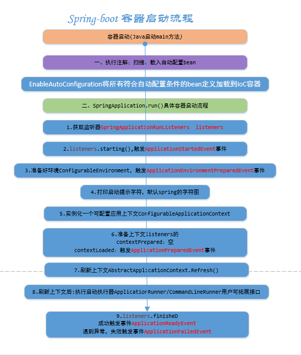

# Spring-Ecosphere

* **Spring** 框架是一个一站式的轻量级的Java开发框架，核心是控制反转(IOC)和面向切面(AOP)，针对于开发WEB层(SpringMVC)、业务层(IOC)、持久层(JdbcTemplate)等提供了多种配置解决方案。其就像是一个大家族，有众多的衍生产品，例如boot、jpa、security等等，它们的基础都是以及 Spring 的 IOC 与AOP ,其中 IOC 提供依赖注入的容器，AOP 解决了面向横向切面的编程，在这两者的基础上实现了其他延伸产品的高级功能。

* **SpringMVC**  是基于servlet 的一个MVC 框架，是Spring 的一个模块，一种轻度耦合的方式解决WEB 开发的问题，主要处理WEB开发的路径映射以及视图渲染。Spring MVC 通过Dispathcher Servlet、ModelAndView、View Resolver,使得开发 WEB 应用变得很容易。

* 因为Spring 的配置非常复杂繁琐，各种各样的XML、JavaConfig等等，于是为了简化开发者的使用，从而创造出了SpringBoot ，约定大于配置，大大简化了Spinrg 的配置流程，实现了自动配置，降低了项目搭建的复杂度。SpringBoot 本身不提供Spring 框架的核心特性以及扩展功能，只是用于快速、敏捷的开发新一代基于Spring 框架的应用程序。这也就是说，SpringBoot 不能用来替代Spring 解决方案，反而是与Spring 框架紧密结合用于提供Spring 开发者体验的工具。换言之，就是SpringBoot 可以快速启动、构建项目，傻瓜式项目开发。同时，SpringBoot也集成了大量常用的第三方配置，例如Jackson、JDBC、Mongo、Redis等等，SpringBoot的第三方类库几乎可以说是开箱即用，而且大部分的应用都只是需要非常少的配置属性代码，方便开发者能更加专注于业务逻辑。
* **SpringBoot**  是有Pivotal 团队提供的全新框架，只涉及的目的就是用来新的Spring 应用的初始搭建以及开放过程。该框架使用了特定的方式来进行配置，从而使开发人员不再需要定义样板化的配置。通过这种方式，SpringBoot 致力于在蓬勃发展的快速应用开发领域成为了领导者。在官网中有这么一段话，翻译过来大概是说：SpingBoot 是所有基于 Spring 开发项目的起点。如果按照我的理解来说，SpringBoot 其实不是什么新的框架，它只是默认设置了很多框架的使用方式，就好像是 Maven 整合了所有的Jar 包，SpringBoot 整合了所有的框架。SpringBoot 提供了各种组件的启动器 starters，开发者只要能配置好对应组件参数， SpringBoot就会自动配置，其 “习惯大于配置”原则，让开发者能快速搭建依赖与Spring 组件的Java 项目。
* Springboot启动流程

SpringBoot 是承载者，只是辅助简化项目的搭建过程，如果承载的是WEB项目的话，使用Spring MVC作为MVC 的框架，那么工作流程还是有Spring MVC来做，并且Spring Boot为SpringMVC 提供的auto-configuration 适用于大多数应用。对于开发者来说，使用Spring Boot以后，项目初始化方法变了，配置文件变了，还有就是不需要单独安装Tomcat 这类容器服务器了，maven将项目打成Jar包直接跑起来就是网站了，但注意的是最核心的业务逻辑实现以及业务流程没有发生变化。

`总之，Spring 是一个“引擎”，Spring MVC 是基于Spring 的一个MVC 框架，Spring Boot 是基于Spring4+的一套“懒人”开发整合包。`
