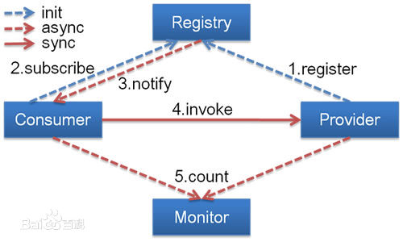

# Dubbo

## 初始 Dubbo 

> &emsp;&emsp;Dubbo是阿里巴巴公司开源的一个高性能优秀的服务框架，使得应用可通过高性能的 RPC 实现服务的输出和输入功能，可以和  Spring 框架无缝集成。Dubbo是一款高性能、轻量级的开源Java RPC框架，它提供了三大核心能力：面向接口的远程方法调用，智能容错和负载均衡，以及服务自动注册和发现。

> &emsp;&emsp;RPC（Remote Procedure Call）—远程过程调用，它是一种通过网络从远程计算机程序上请求服务，而不需要了解底层网络技术的协议，支持负载均衡、容灾和集群功能。

## Dubbo的架构

节点角色说明：

	Provider: 暴露服务的服务提供方。
	Consumer: 调用远程服务的服务消费方。
	Registry: 服务注册与发现的注册中心。
	Monitor: 统计服务的调用次调和调用时间的监控中心。
	Container: 服务运行容器。

调用关系说明：
	
	0. 服务容器负责启动，加载，运行服务提供者。
	1. 服务提供者在启动时，向注册中心注册自己提供的服务。
	2. 服务消费者在启动时，向注册中心订阅自己所需的服务。
	3. 注册中心返回服务提供者地址列表给消费者，如果有变更，注册中心将基于长连接推送变更数据给消费者。
	4. 服务消费者，从提供者地址列表中，基于软负载均衡算法，选一台提供者进行调用，如果调用失败，再选另一台调用。
	5. 服务消费者和提供者，在内存中累计调用次数和调用时间，定时每分钟发送一次统计数据到监控中心。