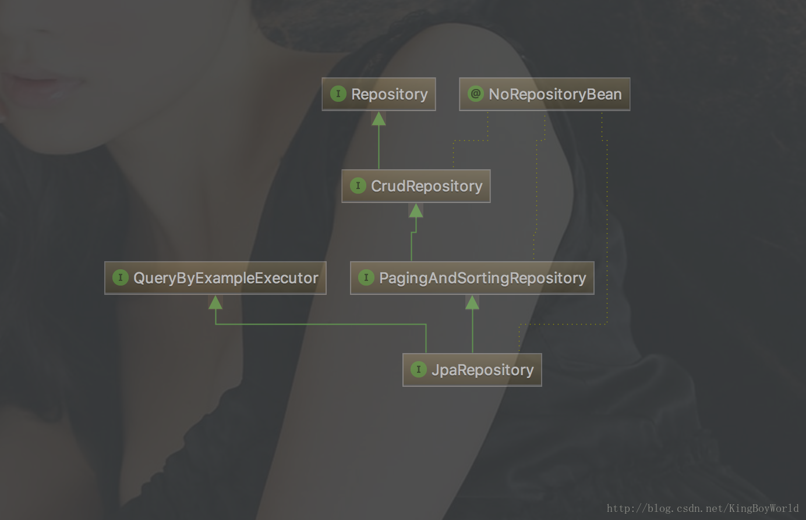

# SpringBoot2-chapter18-springDataJPA

> 即使你是天才，如果你不努力，你也会被其它人超越。


[TOC]


---
> SpringData JPA只是Spring Data中的一个子模块，JPA是一套标准接口。而Hibernate是JPA的实现，Spring Data JPA 底层默认实现是使用Hibernate。Spring Data JPA 的首个接口就是 Repository，它是一个标记接口。只要我们的接口实现这个接口，那么我们就相当于在使用 Spring Data JPA了。




# 项目依赖

```
<!-- SpringBoot依赖 -->
<dependency>
	<groupId>org.springframework.boot</groupId>
    <artifactId>spring-boot-starter</artifactId>
	</dependency>
</dependency>

<!-- 引入lombok 依赖 -->
<dependency>
	<groupId>org.projectlombok</groupId>
	<artifactId>lombok</artifactId>
	<scope>provided</scope>
</dependency>
		
<!--Web必要的-->
<dependency>
    <groupId>org.springframework.boot</groupId>
    <artifactId>spring-boot-starter-web</artifactId>
</dependency>

<!--spring data jpa-->
<dependency>
    <groupId>org.springframework.boot</groupId>
    <artifactId>spring-boot-starter-data-jpa</artifactId>
</dependency>

<!-- MySQL的java依赖 -->
<dependency>
    <groupId>mysql</groupId>
    <artifactId>mysql-connector-java</artifactId>
</dependency>
```

# 配置yml文件

```
#服务端容器的配置
server:
  port: 8218
  tomcat:
    uri-encoding: UTF-8
  servlet:
    context-path: /
    
#数据库配置
    url:  数据库登录地址
    username: #数据库登录账号
    password: #数据库登录密码
    driver-class-name: com.mysql.jdbc.Driver
  jpa:
    hibernate: # 其主要作用是：自动创建、更新、验证数据库表结构
      # ddl-auto: create ## 每次加载hibernate时都会删除上一次的生成的表，然后再重新来生成新表，哪怕两次没有任何改变也要这样执行
      # ddl-auto: update ## 第一次加载hibernate时根据model类会自动建立起表的结构（前提是先建立好数据库），
                         ## 以后加载hibernate时根据model类自动更新表结构，即使表结构改变了但表中的行仍然存在不会删除以前的行。
                         ## 要注意的是当部署到服务器后，表结构是不会被马上建立起来的，是要等应用第一次运行起来后才会。
      ddl-auto: validate ## 每次加载hibernate时，验证创建数据库表结构，只会和数据库中的表进行比较，不会创建新表，但是会插入新值
      # ddl-auto: none   ## 启动时不做任何操作
      naming:
        strategy: org.hibernate.cfg.ImprovedNamingStrategy # 生成的数据表的列的映射策略
        physical-strategy: org.hibernate.boot.model.naming.PhysicalNamingStrategyStandardImpl
    show-sql: true
```

# 写一个User实体

```
@Entity 
@Table(name = "sys_upms_user")  
@Data
public class User {
	@Id // 说明该属性作为该表的主键
	@Column(name = "id", unique = true, nullable = false)
	@GeneratedValue(strategy = GenerationType.IDENTITY)
	private Integer	id;
	@Column
	private String	userName;
	@Column
	private String	password;
	@Column
	private Integer	creator;
	@Column
	private Date	createTime;
	@Column
	private Integer	modifier;
	@Column
	private Date	updateTime;
	@Column
	private String	remark;
}
```
JPA规范注解坐落在`javax.persistence`包下，**@Id注解一定不要引用错了，否则会报错。@GeneratedValue(strategy = GenerationType.IDENTITY)自增策略，不需要映射的字段可以通过@Transient注解排除掉**

> 常见的几种自增策略

- **TABLE**： 使用一个特定的数据库表格来保存主键
- **SEQUENCE**： 根据底层数据库的序列来生成主键，条件是数据库支持序列
- **IDENTITY**： 主键由数据库自动生成（主要是支持自动增长的数据库，如mysql）
- **AUTO**： 主键由程序控制，也是GenerationType的默认值

# 写一个UserRepository

> 创建UserRepository数据访问层接口，需要继承JpaRepository<T,K>

```
public interface UserRepository extends JpaRepository<User, Integer> {

}
```

1.  **Repository** 是一个空接口，即是一个标记接口
2. 若我们定义的接口继承了Repository，则该接口会被IOC容器识别为一个Repository Bean 注入到IOC容器中，进而可以在该接口中定义满足一定规则的接口
3. 它继承Repository接口；继承Repository接口的时候那两个泛型需要指定具体的java类型。`第一个泛型是写实体类的类型,第二个泛型是主键的类型`

# 写一个UserService

```
public interface UserService {
	List<User> getUserList();
}
```

```
@Service
public class UserServiceImpl implements UserService {
	@Autowired
	private UserRepository userRepository;

	@Override
	public List<User> getUserList() {
		return userRepository.findAll();
	}
}
```

# 写一个UserController

```
@RestController
public class UserController {

	@Autowired
	private UserService userService;

	@RequestMapping("getUser")
	public List<User> getUserList() {
		return userService.getUserList();
	}
}
```

# 测试

启动SpringBoot项目：


# 总结

&emsp;&emsp;我们发现使用 springBoot+Spring Data JPA 的方式，不需要很多的配置，更不需要很多的代码就能从数据库中查询到数据。这里仅仅只是入门学习，针对的是对Sprng Data JPA 不太熟悉的，如果想要深入了解，更多内容请参考[官方文档](https://docs.spring.io/spring-data/jpa/docs/current/reference/html/)。
