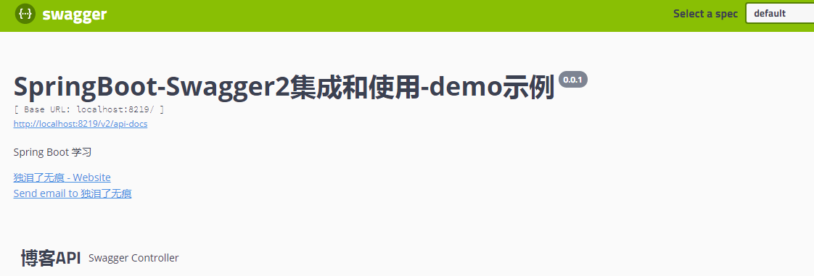
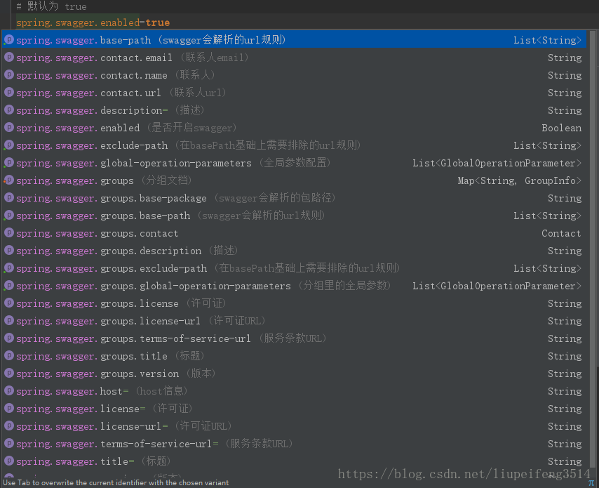
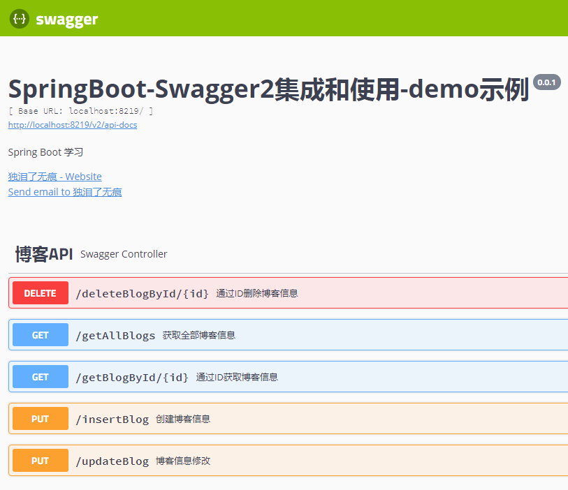
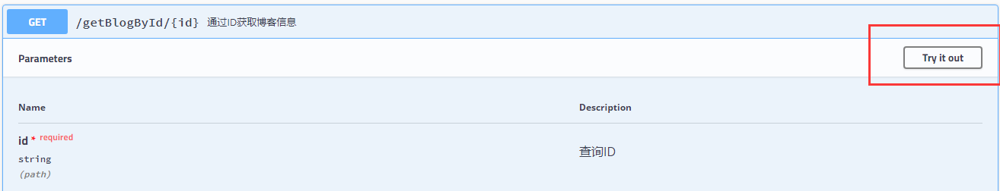
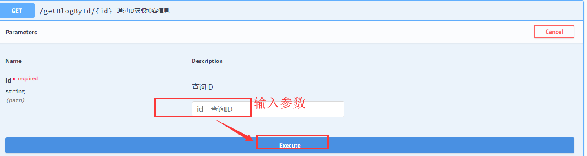
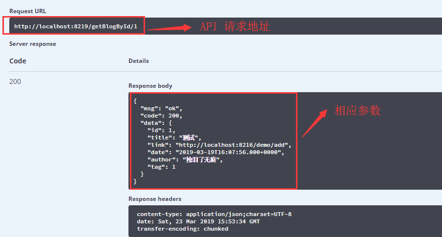
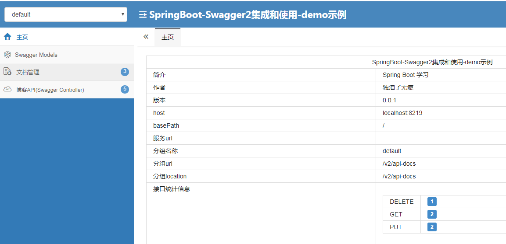
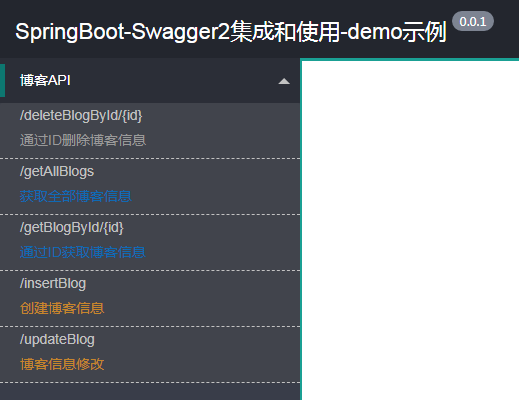

# SpringBoot2-chapter19-swagger2

> 即使你是天才，如果你不努力，你也会被其它人超越。


> **Swagger**是一个流行的API开发框架，用于生成、描述、调用和可视化REST风格的Web服务，这个框架以“开放API声明”为基础，对整个API的开发周期都提供了相应的解决方案，（包括设计、编码和测试，几乎支持所有语言。由于Spring的流行，出现了一个基于Spring的组件swagger-SpringMVC，用于将swagger集成到SpringMVC中来。


# Swagger2介绍

&emsp;&emsp;**Swagger2**是一个可以构建和调试RESTful接口文档的组件，利用**Swagger2**的注解可以快速的在项目中构建Api文档，并且提供了测试API的功能，Swagger让部署管理和使用功能强大的API从未如此简单。



# SpringBoot集成

## 添加Swagger2依赖

```
<!-- 引入 Swagger2依赖 -->
<dependency>
	<groupId>io.springfox</groupId>
	<artifactId>springfox-swagger2</artifactId>
	<version>2.9.2</version>
</dependency>
<dependency>
	<groupId>io.springfox</groupId>
	<artifactId>springfox-swagger-ui</artifactId>
	<version>2.9.2</version>
</dependency>
```

## 创建Swagger2配置文件

> 主要是添加注解 **@EnableSwagger2**和定义Docket的bean类

```
@Configuration
@EnableSwagger2 // 开启 swagger2 功能
public class SwaggerConfig {

	private final String	name	= "独泪了无痕";
	private final String	url		= "https://github.com/dllwh/";
	private final String	email	= "duleilewuhen@sina.com";
	// 是否开启swagger，正式环境一般是需要关闭的，可根据springboot的多环境配置进行设置
	@Value(value = "${swagger.enabled}")
	private Boolean			swaggerEnabled;

	@Bean
	public Docket restApiDocket() {
		return new Docket(DocumentationType.SWAGGER_2) //
				.apiInfo(apiInfo()) // 用来创建该Api的基本信息（这些基本信息会展现在文档页面中）
				.enable(swaggerEnabled) // 是否开启
				.genericModelSubstitutes(DeferredResult.class) //
				.useDefaultResponseMessages(false) //
				.forCodeGeneration(false) //
				.pathMapping("/").select() // 选择那些路径和api会生成document
				.apis(RequestHandlerSelectors.basePackage("org.dllwh")) // 指定扫描的包路径
				.paths(PathSelectors.any())// 指定路径处理PathSelectors.any()代表所有的路径
				.build().pathMapping("/");// 创建
	}

	/**
	 * @方法描述:构建 api文档的详细信息函数
	 * @return
	 */
	private ApiInfo apiInfo() {
		// 联系人信息：联系人名字、联系人URL、联系人email
		Contact contact = new Contact(name, url, email);
		return new ApiInfoBuilder().title("SpringBoot-Swagger2集成和使用-demo示例") // 标题
				.description("Spring Boot 学习") // 描述
				.contact(contact)// 作者信息
				.version("0.0.1")// 版本
				// .extensions(null) //在basePath 基础上需要排除的url规则
				// .termsOfServiceUrl("") // 服务条款url
				// .license("") //许可证
				// .licenseUrl("") //许可证url
				.build();
	}
}
```

## 添加文档内容

### 修改Controller，添加API注解
```
@RestController
@Api(tags = "博客API")
public class SwaggerController {
	@Autowired
	private BlogService blogService;

	@GetMapping("getBlogById/{id}")
	@ApiOperation(value = "通过ID获取博客信息")
	@ApiImplicitParam(name = "id", value = "查询ID", required = true)
	public Map<String, Object> getBlogById(@PathVariable Integer id) {
		Blog blogById = blogService.getBlogById(id);
		if (blogById == null) {
			return Json.fail();
		} else {
			return Json.success(blogById);
		}
	}

	@DeleteMapping("deleteBlogById/{id}")
	@ApiOperation(value = "通过ID删除博客信息")
	public Map<String, Object> deleteBlogById(@PathVariable Integer id) {
		Blog blogById = blogService.getBlogById(id);
		if (blogById == null) {
			return Json.fail();
		} else {
			blogService.deleteBlogById(id);
			return Json.success(blogById);
		}
	}

	@GetMapping("getAllBlogs")
	@ApiOperation(value = "获取全部博客信息")
	public Map<String, Object> getAllBlogs() {
		List<Blog> allBlogs = blogService.getAllBlogs();
		if (allBlogs.size() == 0) {
			return Json.fail();
		} else {
			return Json.success(allBlogs);
		}
	}

	@PutMapping("insertBlog")
	@ApiOperation(value = "创建博客信息")
	public Map<String, Object> insertBlog(Blog blog) {
		blogService.insertBlog(blog);
		return Json.success(blog);
	}

	@PutMapping("updateBlog")
	@ApiOperation(value = "博客信息修改")
	public Map<String, Object> updateBlog(Blog blog) {
		blogService.updateBlog(blog);
		return Json.success(blog);
	}
}
```

# 属性配置



# Swagger访问与使用

api首页路径
```
http://127.0.0.1:8219/swagger-ui.html
```


调试：点击需要访问的api列表，点击try it out!按钮，即可弹出一下页面：



执行：



结果：



# Swagger常用属性说明

|API|说明|
|-----|-----|
|**Api**               |用于controller类上，描述Controller的作用|
|**ApiOperation**      |用在controller的方法上，说明方法的作用|
|**ApiImplicitParams** |用在controller的方法上，包含一组参数说明|
|**ApiImplicitParam**  |用在@ApiImplicitParams的方法里边，指定一个请求参数的各个方面|
|**ApiResponses**      |用在controller的方法上，用于表示一组响应|
|**ApiRespons**        |用在 @ApiResponses里边，一般用于表达一个错误的响应信息|
|**ApiModel**          |用在返回对象类上|
|**ApiModelProperty**  |用在出入参数对象的字段上，描述对象的一个字段|

# 注意事项

继承**WebMvcConfigurationSupport**之后，静态文件映射会出现问题，需要重新指定静态资源，在**WebConfigurer**中添加如下代码：

```
@Override
public void addResourceHandlers(ResourceHandlerRegistry registry) {
    registry.addResourceHandler("swagger-ui.html")
            .addResourceLocations("classpath:/META-INF/resources/");
    registry.addResourceHandler("/webjars/**")
            .addResourceLocations("classpath:/META-INF/resources/webjars/");
    registry.addResourceHandler("/favicon.ico")
            .addResourceLocations("classpath:/META-INF/resources/favicon.ico");
}
```


# 图形界面化

## swagger-bootstrap-ui

swagger-bootstrap-ui是springfox-swagger的增强UI实现，为Java开发者在使用Swagger的时候，能拥有一份简洁、强大的接口文档体验。

```
<!-- Swagger-Bootstrap-UI -->
<dependency>
	<groupId>com.github.xiaoymin</groupId>
	<artifactId>swagger-bootstrap-ui</artifactId>
	<version>${last-version}</version>
</dependency>
```

swagger-bootstrap-ui 的默认访问地址是`http://${host}:${port}/doc.html`



相关使用方法，请查看[Swagger-Bootstrap-UI用户指南](http://www.xiaominfo.com/swagger-bootstrap-ui/)

## swagger-ui-layer

```
<dependency>
  <groupId>com.github.caspar-chen</groupId>
  <artifactId>swagger-ui-layer</artifactId>
  <version>${last-version}</version>
</dependency>
```

- swagger-ui-layer 最新版jar包地址：`https://search.maven.org/search?q=g:com.github.caspar-chen%20AND%20a:swagger-ui-layer`
- swagger-ui-layer 的默认访问地址是`http://${host}:${port}/docs.html`



# 总结

&emsp;&emsp;本章节主要是对Swagger的集成和简单使用进行了说明，详细的用法，可自行搜索相关资料下，这里就不阐述了。