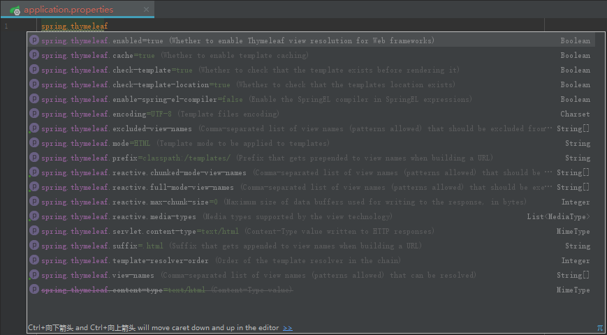

# 1、1 Thymeleaf

&emsp;&emsp;**Thymeleaf**是一种模板引擎框架(TemplateEngine Framework)，无须部署到服务器上，直接通过浏览器就能打开，它可以完全替代 JSP。在有网络和无网络的环境下皆可运行，即它可以让美工在浏览器查看页面的静态效果，也可以让程序员在服务器查看带数据的动态页面效果。Thymeleaf 提供spring标准方言和一个与 SpringMVC 完美集成的可选模块，可以快速的实现表单绑定、属性编辑器、国际化等功能。随着互联网技术的发展，页面静态化的需求越来越明显，传统的jsp动态页面逐渐的被html静态页面+ajax异步请求所替代，模板技术解决了静态页面的数据更新问题。

&emsp;&emsp;Thymeleaf 与JSP类似，最大的区别在于，JSP在运行之后才能得纯HTML，而 Thymeleaf 在运行之前也是纯html。

# 1、2 初识 Thymeleaf Api

&emsp;&emsp;Thymeleaf是⾯向Web和独⽴环境的现代服务器端Java模板引擎，能够处 理HTML，XML，JavaScript，CSS甚⾄纯⽂本。

引入Maven依赖

```
<dependency>
	<groupId>org.thymeleaf</groupId>
	<artifactId>thymeleaf</artifactId>
	<version>x.x.x</version>
</dependency>
```

创建模板，templates/example.html

```
<!DOCTYPE html>
<html lang="en">
<head>
    <meta charset="UTF-8">
    <title>Title</title>
</head>
<body>
    <h1 th:text="${name}">列表名称</h1>
    <ul>
        <li th:each="item: ${array}" th:text="${item}">条目</li>
    </ul>
</body>
</html>
```

使用API渲染模板生成静态页面

```
//构造模板引擎
ClassLoaderTemplateResolver resolver = new ClassLoaderTemplateResolver();
resolver.setPrefix("templates/");//模板所在目录，相对于当前classloader的classpath。
resolver.setSuffix(".html");//模板文件后缀
TemplateEngine templateEngine = new TemplateEngine();
templateEngine.setTemplateResolver(resolver);

//构造上下文(Model)
Context context = new Context();
context.setVariable("name", "蔬菜列表");
context.setVariable("array", new String[]{"土豆", "番茄", "白菜", "芹菜"});

//渲染模板
FileWriter write = new FileWriter("result.html");
templateEngine.process("example", context, write);
```

执行上述代码查看生成结果，result.html

```
<!DOCTYPE html>
<html lang="en">
<head>
    <meta charset="UTF-8">
    <title>Title</title>
</head>
<body>
    <h1>蔬菜列表</h1>
    <ul>
        <li>土豆</li>
        <li>番茄</li>
        <li>白菜</li>
        <li>芹菜</li>
    </ul>
</body>
</html>
```

# 1、3 Thymeleaf与SpringBoot整合

&emsp;&emsp;Thymeleaf 是新一代 Java 模板引擎，在 Spring 4 后推荐使用，下面就简单的讲一讲springboot整合thymeleaf模板。

1.在pom.xml文件引入thymeleaf依赖

```
<!-- 模板引擎 Thymeleaf 依赖 -->
<dependency>
    <groupId>org.springframework.boot</groupId>
    <artifactId>spring-boot-starter-thymeleaf</artifactId>
</dependency>
```

如果是通过idea构建springboot项目，也可以在创建项目时候勾选thymeleaf模板，这样会自动生成。

2. 在application.properties（application.yml）文件中配置thymeleaf

|参数 |	介绍 |
|---|---|
|spring.thymeleaf.cache | 是否启用模板缓存，默认是true|
|spring.thymeleaf.check-template | 检查模板是否存在，默认是true|
|spring.thymeleaf.check-template-location| 检查模板位置是否存在，默认是true|
|spring.thymeleaf.content-type| Content-Type值,，默认是text/html|
|spring.thymeleaf.enabled | 是否开启视图解析，默认是true|
|spring.thymeleaf.encoding | 模板编码，默认是UTF-8|
|spring.thymeleaf.excluded-view-names |要排除的模板名称|
|spring.thymeleaf.mode | 应用模板模式，默认是HTML5|
|spring.thymeleaf.prefix |模板前缀，默认是classpath:/templates/，用于创建模板的url|
|spring.thymeleaf.suffix | 模板的后缀，默认是.html，用于创建木本的url。<br/>“前缀”+模板名称+“后缀”即可定位到具体的模板|
|spring.thymeleaf.template-resolver-order| 默认模板解析器的执行顺序|
|spring.thymeleaf.view-names | 需要解析的模板名称，逗号分隔|

> templates：该目录是安全的。意味着该目录下的内容是不允许外界直接访问的。

- [x] org.springframework.boot.autoconfigure.thymeleaf.ThymeleafProperties类里面有thymeleaf的默认配置。 
- [x] 默认页面映射路径为classpath:/templates/*.html
- [x] **需要特别说明的是“spring.thymeleaf.prefix”配置，该模板文件会放在该类路径下的templates 目录中，默认放在 src/main/resources 目录下**



3.在controller中书写相关代码，注意controller层中注解使用@controller，不要使用@RestController,否则就会出现页面返回字符串而不是正常的html页面。

```
/**
 * @program: springboot-thymeleafnew
 * @description: Thymeleaf入门案例
 * @author: 独泪了无痕
 * @create: 2019-10-11 01：03：00
 */
@Controller
public class DemoController {

    @RequestMapping("/show")
    public String showInfo(Model model){
        model.addAttribute("msg","Thymeleaf入门案例...");
        return "index";
    }
}
```

ModelMap 对象来进行数据绑定到视图。return 字符串，该字符串对应的目录在 resources/templates 下的模板名字。 @ModelAttribute 注解是用来获取页面 Form 表单提交的数据，并绑定到 User 数据对象。

4.在resources下面建立templates文件夹,放置html文件

```
<!DOCTYPE html>
// 是Thyme leaf 命名空间，通过引入该
// 命名空间就可以在HTML 文件中使用Thymeleaf 标签语言，用关键字“ th ” 来标注。
<html xmlns:th="http://www.thymeleaf.org">
<head>
    <meta charset="UTF-8">
    <title>Thymeleaf入门案例</title>
</head>
<body>
    <h1>Thymeleaf入门案例:</h1>
        <span th:text="hello"></span>
        <hr>
        <span th:text="${msg}"></span>
</body>
</html>
```

> Springboot使用thymeleaf作为视图展示，约定将模板文件放置在src/main/resources/templates目录下，静态资源放置在src/main/resources/static目录下

**切记：使用Thymeleaf模板引擎时，必须在html文件上方添加该行代码使用支持Thymeleaf。**

```
<html lang="en" xmlns:th="http://www.thymeleaf.org"> 
```